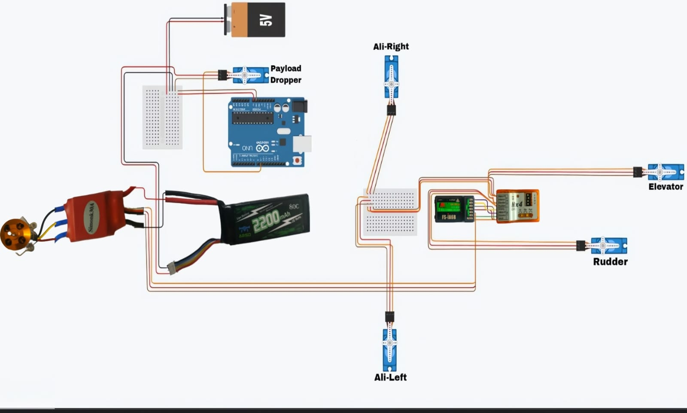
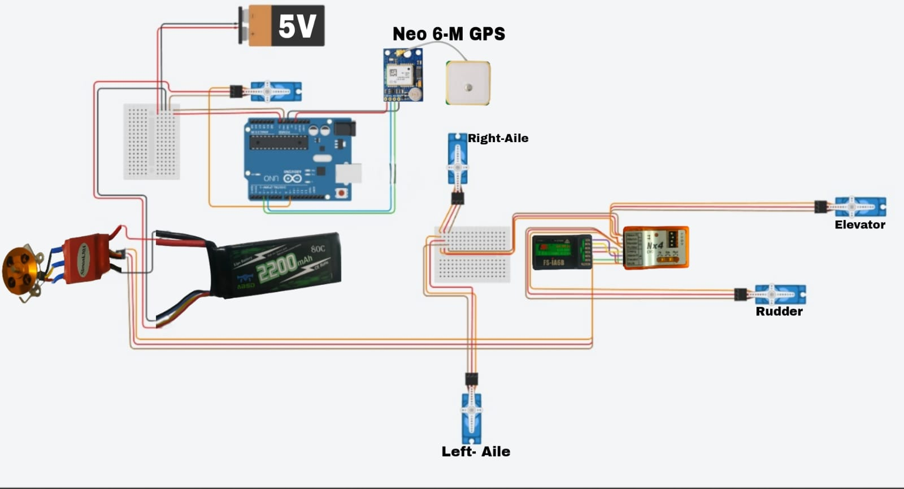

# aero-kriti

This repository contains the Arduino Code and Circuit Diagram for two approaches for the payload dropping:
1. Time based Approach: Please find the code [here](arduino_servo.ino)
   
   

2. GPS based Approach using Neo6m gps module: Please find the code [here](neo6_sevo.ino)

   
